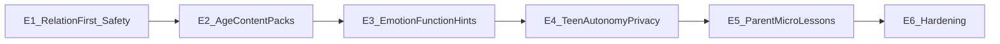

# 学迹 · 分龄与情绪深化总路线图（E1–E5）

承接青少年心理 / 家庭教育分析与既有教育轨落地成果。  
**本文档为后续开发唯一总参照**；按期拆 PR，前一期验收后再开后一期。

状态：**E1–E5 已完成**（E5 见 [`EDU_E5_PARENT_PLAN.md`](./EDU_E5_PARENT_PLAN.md)）。  
**下一轨：** [`EDU_E6_HARDENING_PLAN.md`](./EDU_E6_HARDENING_PLAN.md)（验收加固）；可选产品轨 [`V1_5_ACHIEVEMENT_BONUS_PLAN.md`](./V1_5_ACHIEVEMENT_BONUS_PLAN.md)。总索引 [`NEXT_TRACK_INDEX.md`](./NEXT_TRACK_INDEX.md)。

---

## 1. 背景与承接

本路线图在下列已落地工作之上做**分龄差异化 + 情绪防工具化 + 关系优先**深化，避免重复造轮：

| 既有计划 | 关系 |
|----------|------|
| [`EDU_PEDU_A_PLAN.md`](./EDU_PEDU_A_PLAN.md) | 情绪教练芯片、周末小会仪式、淡出二次软提醒 — **保留并约束用途** |
| [`EDU_MOTIVATION_PLAN.md`](./EDU_MOTIVATION_PLAN.md) / [`EDU_MOTIVATION_P1P2_PLAN.md`](./EDU_MOTIVATION_P1P2_PLAN.md) / [`EDU_MOTIVATION_P2_PLAN.md`](./EDU_MOTIVATION_P2_PLAN.md) | 过程庆祝、淡出、`ageBand`、低龄约定护栏 — **E1/E2 在其上加共见契约与内容包** |
| [`EDU_INTRINSIC_P0P1_PLAN.md`](./EDU_INTRINSIC_P0P1_PLAN.md) / [`EDU_INTRINSIC_P2_PLAN.md`](./EDU_INTRINSIC_P2_PLAN.md) | 反思芯片、成长句、兴趣任务、星星叙事、teen 小目标 — **E2/E4 增强可见性与默认值** |
| [`EDU_FAMILY_JOURNAL_P0_PLAN.md`](./EDU_FAMILY_JOURNAL_P0_PLAN.md) / [`EDU_FAMILY_JOURNAL_IMPROVE_PLAN.md`](./EDU_FAMILY_JOURNAL_IMPROVE_PLAN.md) / [`EDU_FAMILY_JOURNAL_P3_PLAN.md`](./EDU_FAMILY_JOURNAL_P3_PLAN.md) | 说说不计分、私密/代登边界 — **E1/E3/E4 不得破坏** |
| [`EDU_PHASE1_PLAN.md`](./EDU_PHASE1_PLAN.md) | 默认淡出、任务提议、词云、过载提示、周目标 — **E1.1/E1.5 改 IA 与出口，不改结算** |
| [`Q2_ATMOSPHERE_AGE_PLAN.md`](./Q2_ATMOSPHERE_AGE_PLAN.md) | young/teen 展示气质 — **E2 扩展为内容包，不另开路由** |
| [`DEVELOPMENT_PLAN.md`](../DEVELOPMENT_PLAN.md) | 五阶段合理化改进已完成 — 本路线为下一教育深化轨 |

手测总清单锚点：[`HANDTEST_REGRESSION_MASTER.md`](./HANDTEST_REGRESSION_MASTER.md)「分龄情绪路线图 E1–E5」与「E6 / V1.5」。

---

## 2. 产品定案（开发不得偏离）

1. **分龄模型**  
   - 心理画像：A(6–8) / B(9–11) / C(12–14) / D(15–18)。  
   - 产品字段仍用 `young | general | teen`（学生 `users.age_band` 可空回落家庭 `family_settings.age_band`）。  
   - **不新增第四个 age_band 枚举**。差异靠内容包 + 默认策略 + 信息架构。

2. **原则**  
   - 脚手架优先于新表；文案与 IA 优先于改公式。  
   - **不静默改 `rewardMode`**（GET 不写库；保存 / 家长确认才生效）。  
   - 说说不计分、不进 Monitor 待办；周末小会是仪式不是 KPI。  
   - 危机：只做减负文案与转介入口，**不做诊疗、不做自动定罪、不做内容审查报警**。

3. **执行顺序**  
   E1 → E2 → E3 → E4 → E5（已完成）→ **E6 验收加固**（见 [`EDU_E6_HARDENING_PLAN.md`](./EDU_E6_HARDENING_PLAN.md)）；V1.5 成就奖金为可选并行轨。

---

## 3. 发展画像 A–D ↔ ageBand 映射

| 发展段 | 约略年龄 | 映射 ageBand | 核心议题 | 产品侧重（摘要） |
|--------|----------|--------------|----------|------------------|
| **A** | 6–8 | `young` | 共同调节、具象、依恋安全 | 极简今日、弱/无代币叙事、短小会、即时温暖 |
| **B** | 9–11 | `young` 或 `general` | 公平、能力感、淡出窗口 | 淡出共见、手足公平、兴趣 0 分建议、微行动闭环 |
| **C** | 12–14 | `general` 或 `teen` | 自主、羞耻、监视敏感 | 关系摘要、隐私、提议/换序、少 Push 未完成 |
| **D** | 15–18 | `teen` | 准成人协商、隐私、意义 | 弱/无分叙事、私密默认、转介、反幼稚化小会 |

混龄家庭：**策略按孩子 `ageBand`**，禁止跨孩完成率/积分并排攀比组件（E1.1 验收约束）。

---

## 4. 总览

| 期 | 主题 | 状态 | 工程量级（估） |
|----|------|------|----------------|
| **E1** | 关系优先与防工具化 | 已完成 | 中（多为前端 IA + 文案） |
| **E2** | 分龄内容包 young/general/teen | 已完成 | 中 |
| **E3** | 情绪功能分类（家长侧） | 已完成 | 小～中（纯函数 + 旁注） |
| **E4** | Teen 自主、隐私与边界 | 已完成 | 中（尽量小迁移） |
| **E5** | 家长微课与关系自检 | 已完成 | 小～中（内容 + 轻 UI） |
| **E6** | 验收加固与体验打磨 | 工程完成（真机待勾） | 小～中（见 [`EDU_E6_HARDENING_PLAN.md`](./EDU_E6_HARDENING_PLAN.md)） |

---

## 5. 各期详细规格

### E1 — 关系优先与防工具化（高杠杆）

**目标：** 降低监视与绩效突显；淡出变成家庭共见契约；情绪聚合不作问责；兴趣不被刷分；高压有减负出口。

| ID | 项 | 状态 | 用户故事 | 主要触点 | API / 迁移 | 验收 | 风险 |
|----|-----|------|----------|----------|------------|------|------|
| **E1.1** | Monitor 默认「关系摘要」 | 已完成 | 家长打开看板先看到鼓励/说说/小会/洞察；完成率与未完成需展开 | `MonitorView.vue`（`statsOpen` 默认收起数字） | 无 | 首屏不突出多孩完成率对比；展开后确认/待办仍可用；窄屏回归 | 家长习惯「一眼监工」— 用可展开保留效率 |
| **E1.2** | 淡出「家庭共见契约」 | 已完成 | 约定页说明三阶段；学生可见「我们家在练习少靠积分」 | `FamilyEduView.vue` + `TodayView` + `eduRelationCopy.ts` | 仍 PUT `/family/settings` 才改 `rewardMode` | GET 不写库；学生条可 dismiss；与 P-Edu-A A3 兼容 | 文案过长 — 限一句 |
| **E1.3** | 模式句/词云用途声明 | 已完成 | 小会「本周模式」、周报词云旁固定「用来聊聊，不是评分」 | `WeekendMeetingView.vue`；`ReportsView` | 无；不把 hint 推进 Monitor 待办 | 不出现待办化入口；文案 unit 可锁关键字 | 家长口头仍问责 — E3/E5 补话术 |
| **E1.4** | 兴趣任务默认建议 0 分 | 已完成 | 勾选「兴趣探索」时分值预填 0 + 说明可改 | `TasksView.vue` watch；`ParentTaskFormFields` | 无强制 API | 可改回正分；庆祝仍兴趣弱分 | 家长忽略说明 — 旁注 |
| **E1.5** | 减负 / 求助软出口 | 已完成 | 过载洞察「去减任务 / 求助与减负」 | `MonitorView` + `eduRelationCopy` 静态文案 | 无强制写库 | 无诊断标签；可 SoftPrompt / 去任务 | 文案过重医疗化 — 只用「减负+转介」 |

**E1 非目标：** 改积分公式；重做整个 Monitor；AI 诊断。

**E1 建议测试：** web unit（文案/折叠默认）；e2e 抽样看板首屏；人手：多孩家庭观感。

---

### E2 — 分龄内容包（young / general / teen）

**目标：** 同路由、三套内容强度；映射 A–D 而不增枚举。

| ID | 项 | 状态 | 用户故事 | 主要触点 | API / 迁移 | 验收 | 风险 |
|----|-----|------|----------|----------|------------|------|------|
| **E2.1** | `ageContentPack` 纯函数 | 已完成 | 按 ageBand 返回：今日默认可见条数、小会步数/建议时长、代币叙事强度、心情词表子集 | `ageContentPack.ts`；消费方 Today / WeekendMeeting / CheckinDrawer / points 委托 | 无 | 三档差异可单测；`general` 为回归基线不破 | 过度分支 — pack 表驱动 |
| **E2.2** | young 短小会 + 共同调节 | 已完成 | young 小会 2 步（骄傲+感谢）；确认模板偏看见/抱抱 | `WeekendMeetingView`；`MonitorView` approve；心情子集 | 无 | 手测 young 无三步检讨感 | 按孩子 band 切换 |
| **E2.3** | general 淡出 + 公平/非买物提示 | 已完成 | 约定页淡出共见 + 非买物提示；愿望页引导 | `FamilyEduView`、`WishesView`、`RewardsView` | 与现有 fade 兼容 | 不强制改历史 `rewardMode` | — |
| **E2.4** | teen 自主入口显眼 + 余额降权 | 已完成 | teen 提议条/先做这件更显眼；Rewards 余额视觉降权 | `TodayView`、`RewardsView` | 无；不改 ledger | 不改积分公式 | — |

**E2 非目标：** 新路由「儿童版 App」；改 settings schema 强制 rewardMode。

**E2 建议测试：** `ageContentPack.spec.ts`；Q2 手测项对齐；young/teen 各一趟 Today + 小会。

---

### E3 — 情绪功能分类（家长侧脚手架）

**目标：** 把「累/难/缓做」等信号解释成四类**给家长的**提示，避免态度归因；不对学生打情绪分。

四类：**耗竭 / 能力威胁 / 关系威胁 / 意义缺失**。

| ID | 项 | 状态 | 用户故事 | 主要触点 | API / 迁移 | 验收 | 风险 |
|----|-----|------|----------|----------|------------|------|------|
| **E3.1** | 映射纯函数 | 已完成 | 输入 mood/缓做/过载等 → 主类型 + 家长旁注 | `emotionFunctionHint.ts`；Monitor / 小会 | 无 | unit 覆盖四类；UI 不展示分数/排行 | 文案用「可能」 |
| **E3.2** | 话术芯片按类建议 | 已完成 | 家长说说/确认 SoftPrompt 按类推荐 | `journalSoftCopy`；Monitor approve | 无 | 仍禁止绩效夸；与 P-Edu-A A1 兼容 | 每类 ≤3 |
| **E3.3** | 考试周 / 周末弱策略条 | 已完成 | 日历启发式条幅，可 dismiss | Monitor | 无 | 可关；不改任务数据 | 仅提示 |

**E3 非目标：** 情绪评分；把分类写入学生档案标签；Monitor 待办化。

---

### E4 — Teen 自主、隐私与边界

**目标：** C/D 段降低监视与表演性顺从；隐私默认；弱分可选；危机转介静态可见。

| ID | 项 | 状态 | 用户故事 | 主要触点 | API / 迁移 | 验收 | 风险 |
|----|-----|------|----------|----------|------------|------|------|
| **E4.1** | 反思可见性偏好 | 已完成 | teen 打卡反思默认「仅自己」；家长即时可见需勾选同意 | `TodayView` / `CheckinDrawer`；`teenPrivacy.ts` | **前端偏好**（未勾选不写 API + 本地暂存）；零迁移 | 家长即时可见路径有明示同意；私密不被代登打开 | — |
| **E4.2** | teen 弱积分 / 无分叙事引导 | 已完成 | 约定页对 teen 孩提示导向 `weekly_digest`；保存才生效 | `FamilyEduView`；学生 Today 弱提示 | 不静默写库 | 可改回 always；文案写清「家庭级设置」 | — |
| **E4.3** | 代登 / 私密加强 | 已完成 | 代登发说说更强提示；teen 私密引导更显眼 | `JournalView.vue`；`journalSoftCopy.ts` | 既有 API：代登不可读写私密 | 回归私密/代登 | — |
| **E4.4** | 危机转介入口 | 已完成 | More / 教育设置 / 洞察 CTA 打开静态求助指引 | `HELP_RESOURCES_*`；FamilyEdu / More / Monitor SoftPrompt | 无自动报警 | 无诊断称号 | — |

**E4 非目标：** 成绩现金默认开；AI 监测自伤并上报。

---

### E5 — 家长微课与关系自检

**目标：** 改教养心智，而非再堆监控功能。

| ID | 项 | 状态 | 用户故事 | 主要触点 | API / 迁移 | 验收 | 风险 |
|----|-----|------|----------|----------|------------|------|------|
| **E5.1** | 分龄场景微课 5–10 则 | 已完成 | 不愿做 / 质量差 / 说谎打卡 / 手足冲突 / 考试周 / 连续「累」等；只读 + 深链到约定/小会/说说 | `FamilyEduView`「教育小贴士」；`parentMicroLessons.ts` | 无 | 每则标注适用 ageBand；深链可用 | 文案过长 — 每则 ≤1 屏 |
| **E5.2** | 月度自愿关系自检 | 已完成 | 3～5 题（如：有一次不被评价的聊天吗？孩子选过顺序吗？）可跳过；不打分不上榜 | FamilyEdu「本月关系自检」；`relationSelfCheck.ts` localStorage | **本地** | 可跳过；无排行/无强制 | — |
| **E5.3** | HANDTEST 对齐 | 已完成 | 总清单 E1–E5 人手项与路线图 ID 一致并在落地后勾选 | `HANDTEST_REGRESSION_MASTER.md` | 无 | ID 一一对应 | — |

**E5 非目标：** 强制家长考试；上传自检打家庭分。

---

### E6 — 验收加固与体验打磨

**目标：** 真机闭环；补齐 E4.1 隐私缺口（先前端回看，不足再小迁移）；混龄切 pack；微课↔情绪深链；e2e 抽样。  
**详细规格：** [`EDU_E6_HARDENING_PLAN.md`](./EDU_E6_HARDENING_PLAN.md)。

| ID | 项 | 状态 | 摘要 |
|----|-----|------|------|
| **E6.0** | 真机验收闸门 | 人手待勾 | 勾选 HANDTEST E1–E5 真机项或记缺陷 |
| **E6.1** | 私密反思学生自回看 | 已完成 | 本机 stash 列表；零迁移 |
| **E6.2** | 反思可见性入库 | 暂缓 | **可选**；仅当真机证明前端不足 |
| **E6.3** | 混龄按选中孩切 pack | 已完成 | FamilyEdu 微课跟孩子 ageBand |
| **E6.4** | 微课 ↔ E3 深链 | 已完成 | Monitor 旁注 CTA |
| **E6.5** | e2e 抽样 | 已完成 | `e6-hardening.spec.ts` |
| **E6.6** | 文档闭环 | 已完成 | HANDTEST E6 节 |

**E6 非目标：** 再堆监控；把 V1.5 塞进教育轨；第四 age_band。

---

## 6. 跨期工程约束

1. **文案：** 关键 SoftCopy / 旁注尽量 unit 锁关键字（防绩效夸、防「评分」话术回退）。  
2. **e2e：** 每期至少抽样 1 条关键路径（E1 看板首屏、E2 young 今日、E4 私密/代登）。  
3. **配置：** 禁止 GET `/family/settings` 或 dashboard 时写 `rewardMode`。  
4. **说说 / 小会：** 不得计分、不得进 Monitor 待办队列。  
5. **分龄：** 读学生 `ageBand`，空则家庭默认；混龄按当前选中孩子切换 pack。  
6. **迁移：** 仅 E4.1 等在「前端方案不足」时允许小迁移；E1–E3、E5 默认零迁移。  
7. **生产：** 行为变更随飞牛预编译包发布；`docker-start.sh` 按 lock 重装依赖（既有部署约定）。

---

## 7. 推荐执行顺序与依赖

| 顺序 | 依赖 | 说明 |
|------|------|------|
| E1 | 无（可直接开） | 最高教育杠杆；不依赖内容包 |
| E2 | 建议 E1.3 已合并 | 避免内容包与「用途声明」文案冲突 |
| E3 | 建议 E1.3、E2.1 | 旁注挂在 Monitor/小会与 pack 心情词表上 |
| E4 | 建议 E1、E2.4 | 自主/隐私建立在关系摘要与 teen 入口上 |
| E5 | 建议 E1.5、E3 | 微课深链减负出口与四类话术 |
| E6 | E1–E5 已完成 | 真机闸门优先；E6.2 按需；详见 E6 计划 |

并行许可：E1.4（兴趣 0 分）可与 E1.1 并行；E5.1 内容撰写可与 E4 工程并行，合并前需 E1.5 锚点存在。  
E6 与 V1.5 可并行目录开发；建议 E6.0 无 P0 后再合入成就奖金。

---

## 8. 手测与回归锚点

总清单分区见 [`HANDTEST_REGRESSION_MASTER.md`](./HANDTEST_REGRESSION_MASTER.md)「分龄情绪路线图 E1–E5」。

落地某期时：将该期 ID 在路线图「状态」列改为「完成」，并勾选 HANDTEST 对应项。

### 分龄手测矩阵（每期抽测）

| ageBand | 必看页 |
|---------|--------|
| young | Today 下一件、庆祝、小会时长/步数、星星叙事 |
| general | 约定淡出、愿望非买物提示、小会三步、Monitor 折叠 |
| teen | 提议/换序、Rewards 弱余额、私密/代登、弱分引导 |

---

## 9. 明确非目标（全集）

- 新增第四 `age_band`；强制历史家庭改写 `rewardMode`
- 说说 / 反思计分或 Monitor 待办化
- AI 自动诊断、情绪评分排行、成绩现金默认开启
- 改积分 ledger 公式；用星星替换后端积分字段
- 自伤/自杀内容自动报警或平台侧强制上报

---

## 10. 迁移总览

| 期 | 迁移预期 |
|----|----------|
| E1 | 无 |
| E2 | 无 |
| E3 | 无 |
| E4 | 仅当 E4.1 前端方案不足时小迁移（可选） |
| E5 | 无（自检优先 localStorage） |
| E6 | 默认无；**仅 E6.2** 可选小列 `reflection_visibility` |

---

## 11. 参考

- 实体：`apps/api/src/entities/user.entity.ts`（`ageBand`）、`family-settings.entity.ts`  
- 淡出 / 过载：`dashboard.service.ts`、`MonitorView.vue`、`fadeRenudge.ts`  
- 小会：`WeekendMeetingView.vue`、`weekend-pattern-hint.ts`、`weekendRitual.ts`  
- 兴趣：`TasksView.vue`、`is_interest` / intrinsic P2  
- 说说：`journalSoftCopy.ts`、`JournalView.vue`
