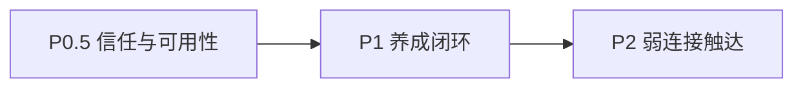

# 学迹 · 家庭手账改进实施计划（P0.5 → P1 → P2）

承接 [EDU_FAMILY_JOURNAL_P0_PLAN.md](./EDU_FAMILY_JOURNAL_P0_PLAN.md) 已落地的双层模型；按「先信任与可用性 → 再养成 → 最后触达」分期。

**不改动的定案：** 不计分、不进 Monitor 待办；私密默认关；代登不可读写私密；分享是副本、不开放原文读权限；不经剪贴板。

---

## 分期总览

| 期 | 主题 | 目标 | 预估量级 |
|----|------|------|----------|
| **P0.5** | 热修：信任与可用性 | 分页可用、可见性查询正确、删帖可审计、分享不刷屏、分享可选可见性、误删防护 | 小～中（约 1 轮） |
| **P1** | 养成：闭环与完整自愿 | 未读轻提示、关闭私密、回应模板、短时编辑、评论自删 UI；二级跟帖/配图按容量选做 | 中 |
| **P2** | 触达：弱连接 | 周末小会引用、可选 Push、作品集弱链、More 外软发现 | 完成 |

---

## P0.5（本轮优先开发）

### 产品定案补丁

| 项 | 定案 |
|----|------|
| 时间线 | 前端「加载更多」；`beforeId` 与现 API 对齐 |
| 可见性查询 | 列表按角色过滤后再凑满 `limit`，避免学生端一页过稀 |
| 删帖 | 保留「作者或家庭家长可删」；**写 audit**；家长删他帖 SoftPrompt 文案标明「删的是孩子/家人的表达」 |
| 重复分享 | 若该日记已有 `source_private_diary_id` 活跃帖：提示「已分享过」；默认拦截；可选「仍要再发」二次确认 |
| 分享可见性 | SoftPrompt 层 2 或层 1 后可选 `family` / `parents`（默认 `family`） |
| 删日记 | SoftPrompt 确认（文案进 `journalSoftCopy`） |
| 删评论 | UI 暴露自删（作者）；家长删评沿用现 API + SoftPrompt |

### 任务拆解

| ID | 项 | 主要落点 | 状态 |
|----|-----|----------|------|
| **J05.1** | 计划文档 + HANDTEST 小节 | `docs/` | 完成 |
| **J05.2** | `listPosts` 按角色可见性过滤并补足 limit | `journal.service` + `journal-visibility` | 完成 |
| **J05.3** | 删帖/删评写 `AuditService` | `journal.service` + FamilyModule | 完成 |
| **J05.4** | `share-to-family`：`visibility` + 重复检测/`force` | controller + service | 完成 |
| **J05.5** | JournalView：加载更多、分享可见性、重复分享、删日记 Soft、评论自删；修复 http 解包 | `JournalView` + SoftCopy | 完成 |
| **J05.6** | unit / e2e；勾 HANDTEST | specs | 完成 |

### API 变更（P0.5）

- `GET /journal/posts`：行为增强（同路径）；保证返回条数在「有足够数据」时尽量凑满 `limit`。
- `POST /journal/private-diary/:id/share-to-family`  
  - body：`{ visibility?: 'family'|'parents', force?: boolean }`  
  - 已存在活跃分享且未 `force` → `409` 或业务码 `already_shared`（与现错误风格对齐）。
- 删帖/删评：响应仍 `{ ok: true }`；侧写 audit。

### 前端要点（P0.5）

- 时间线底部「加载更多」：用最后一条 `id` 作 `beforeId`。
- 分享层 2：可见性单选 +「确认发布」；若已分享过：先提示再 `force`。
- 代登写家庭帖：发帖抽屉增加一句「发言将记在当前孩子名下」（文案 unit 可选）。

### P0.5 验收

- [x] 学生端在大量「仅家长」帖存在时，全家可见帖仍能持续刷出（可见性 unit）
- [x] 加载更多可继续拉历史（e2e mock）
- [x] 同日记二次分享默认拦截；`force` 后可再发（API Conflict + SoftPrompt）
- [x] 分享可选「仅家长」
- [x] 删帖/删评有 audit；家长删非本人帖 SoftPrompt 含「家人表达」
- [x] 删私密日记须 SoftPrompt
- [x] 评论作者可自删
- [x] unit + e2e 抽样；HANDTEST 勾自动化项

### P0.5 非目标

二级跟帖、配图、未读角标、关闭私密 UI、Push、周末引用、编辑帖正文。

---

## P1（养成，P0.5 合并后另开）

| ID | 项 | 理由 | 状态 |
|----|-----|------|------|
| **J1.1** | 私密「关闭」入口 + SoftPrompt；关后只读保留 | 自愿开对应自愿关 | 完成 |
| **J1.2** | 评论轻未读（`activity-hint` / `mark-seen` + More 角标） | 回应闭环 | 完成 |
| **J1.3** | 发帖/回应可选话术芯片 | 降低冷启动 | 完成 |
| **J1.4** | 帖/日记 15 分钟内可编辑 | 减少删重发 | 完成 |
| **J1.5** | 二级跟帖 | 对话感 | 完成 |
| **J1.6** | 家庭帖配图 | 低龄表达 | 完成 |

另：**分龄命名** 幼龄「给家人看 / 我的悄悄话」，其余「家庭说说 / 我的私密日记」（见 `journalLabels.ts`）。

**P1 建议顺序：** J1.1 → J1.3 → J1.4 → J1.2 → J1.5 → J1.6（本轮已完成前四项）。

**P1 非目标：** 主题自动绑任务、积分挂钩、看板待办化。

---

## P2（弱连接触达）

| ID | 项 | 约束 | 状态 |
|----|-----|------|------|
| **J2.1** | 周末小会可「引用一条家庭帖」（只读摘要 + 深链到手账） | 弱引用；不强制选帖 | 完成 |
| **J2.2** | 新回应可选 Push（有订阅才送达；深链手账） | 跟随 Push 订阅；深链 `/parent\|student/journal` | 完成 |
| **J2.3** | 作品集弱链「去家庭说说」 | 单向、自愿；不做展览墙 | 完成 |
| **J2.4** | 看板/今日非待办区「本周有手账」软提示 | 不进待办；可关 | 完成 |

迁移：`1740000000035`（`student_weekly_reviews.journal_post_id`）。

---

## 实现顺序（确认后按此提交）

### 本轮（P0.5）

1. 本文档 + HANDTEST「家庭手账 P0.5」小节  
2. `listPosts` 可见性补足 +（可选）家庭成员查询收敛  
3. 删帖/删评 audit  
4. share API：`visibility` + 重复检测/`force`  
5. JournalView + SoftCopy + 代登发帖提示  
6. unit / e2e / HANDTEST 勾选  

### 随后

7. ~~开 P1 计划文件并开发 J1.1～J1.4~~ ✅  
8. ~~容量允许再做 J1.5～J1.6~~ ✅  
9. ~~P2 与周末小会/Push 模块对齐~~ ✅  

生产：迁移号自 `1740000000033` 起（含 0034 配图、0035 小会引用）；`DB_MIGRATIONS_RUN=true`。

---

### HANDTEST 增补草案（实现时写入 MASTER）

### 家庭手账（P0.5）

- [x] 加载更多与可见性补足（e2e 或人手）
- [x] 重复分享拦截 + force；分享仅家长（人手 + unit）
- [x] 删日记 SoftPrompt；评论自删；删帖 audit（unit/人手）

### 家庭手账（P1 · J1.1～J1.4）

- [x] 关闭私密 + 只读；话术芯片；短时编辑；轻未读角标

### 家庭手账（P2）

- [x] 周末小会引用帖 + `?postId=` 深链（e2e / 人手）
- [x] 作品集弱链；今日/看板软发现（unit + e2e）
- [ ] 真机 Push 有订阅时评论通知（人手）

### 家庭手账（P3）

见 [EDU_FAMILY_JOURNAL_P3_PLAN.md](./EDU_FAMILY_JOURNAL_P3_PLAN.md)。

- [x] Push 偏好可关；引用摘要固化；限流文案；e2e

### 人手（跨期保留）

- [x] API 抽检：真发帖 + 私密开写 + 分享；代登确认看不到私密（本轮 API）
- [x] API：二层分享到家庭手账可用（本轮）
- [x] e2e：关闭私密 / 短时编辑 / More 角标（`journal-p1-regression`）
- [x] API：周末引用保存与删帖后摘要（P2/P3）
- [ ] 真机浏览器 Push 订阅开关偏好（P3）
